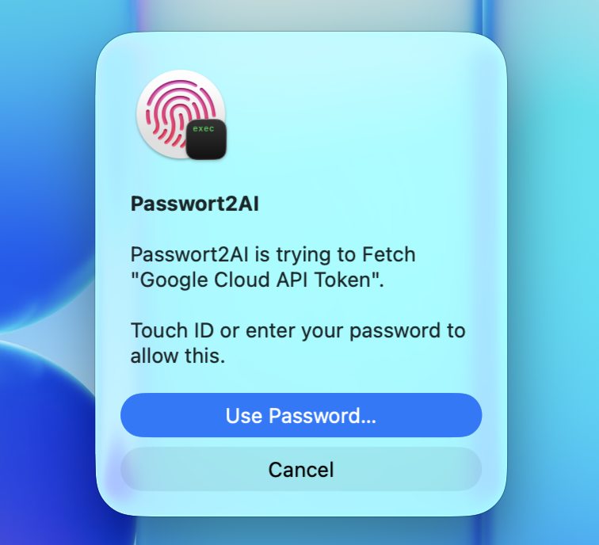

# Passwort2AI by Fingerprint 🫆

<p align="center">
  
</p>

## All your passwords in one place. Securely stored, invisible to AI, covered by your fingerprint.

You're a dev with 30+ tokens. Every coding agent (Claude Code, Cursor, Aider, Cline, Copilot) wants one.

### ❌ Bad options you have (from worst to bad)

| Option | Downside |
|---|---|
| Hardcoded "just for testing" | Stays in git blame forever. |
| Copy-paste into chat | Exhausting. Now in chat history, prompt logs, vendor servers, possibly training data. |
| `.env` files | Annoying, scattered, one of them accidentally committed to another repo somewhere. |
| "It's in your clipboard" | You have to type that prompt every single time. Value lives in clipboard history and Universal Clipboard. |

### ✅ p2ai

<table>
<tr><th align="center">Option</th><th>Upside</th></tr>
<tr>
  <td rowspan="21" align="center" valign="middle"></td>
  <td>Installs with 1 Prompt</td>
</tr>
<tr><td>In encrypted Database</td></tr>
<tr><td>AI must ask to get secrets</td></tr>
<tr><td>only you can give permission</td></tr>
<tr><td>2 Seconds to install</td></tr>
<tr><td>1 Second to paste Password</td></tr>
<tr><td>AI can't see the password, just gets a closed letter</td></tr>
<tr><td>fast mode available</td></tr>
<tr><td>zero retention mode available</td></tr>
<tr><td>never leak again</td></tr>
<tr><td>never search again</td></tr>
<tr><td>all in one place, organized</td></tr>
<tr><td>manageable by AI</td></tr>
<tr><td>import by script</td></tr>
<tr><td>local-first, DB stays on your machine</td></tr>
<tr><td>auto-locks on screen lock</td></tr>
<tr><td>clipboard auto-clears after 30s</td></tr>
<tr><td>TOTP codes too</td></tr>
<tr><td>binary attachments too</td></tr>
<tr><td>auto-generates 24-char passwords</td></tr>
<tr><td>signed releases, MIT, open source</td></tr>
</table>

> [!TIP]
> **Main advantage: Speed `+++` Security `++`**

|  | Paste into chat | `pbpaste` to AI | **`p2ai run`** |
|---|---|---|---|
| ⌨️ **Keystrokes** | `Cmd+Tab`, click value, `Cmd+C`, `Cmd+Tab`, click chat input, `Cmd+V` (4 keys + 2 clicks) | `Cmd+C` plus typing "use the token in my clipboard for X" (~50) | <kbd>🫆 Touch-ID</kbd> · **1 tap** |
| 👀 **Who sees it** | you, the LLM, vendor servers, log pipelines, possibly training data | you, your clipboard history, every device on your iCloud account | ✅ **only the target tool** |

## Install

```bash
brew install silverstar187/p2ai/passwort2ai
p2ai setup
```

`p2ai setup` enrolls your master into the macOS Keychain and picks your `.kdbx`.

For AI agents (Claude Code, Cursor, Aider, Cline):

```bash
p2ai system-prompt > .cursorrules        # or >> CLAUDE.md / .aider.conf.yml
```

<details>
<summary>Install from source</summary>

```bash
git clone --branch v0.5.0 --depth 1 https://github.com/Silverstar187/passwort2ai-by-fingerprint.git ~/.passwort2ai
~/.passwort2ai/install.sh
p2ai setup
```
</details>

## Daily use

```bash
# Run a tool with secrets injected (primary pattern)
p2ai run -e GH_TOKEN='GitHub Token' -- gh repo list
p2ai run -e DB='Postgres Prod' -- psql
p2ai run -e A='AWS Key' -e B='AWS Secret' -- aws s3 ls
p2ai run -e USR='Service'::UserName -- some-tool   # specific attribute
p2ai run -f .p2ai.env -- ./deploy.sh               # mappings from a dotenv file

# Fetch to clipboard (for human paste)
p2ai fetch "<entry>"                              # clipboard, auto-clear 30s
p2ai fetch "<entry>" --attr UserName              # any attribute
p2ai list [query]                                 # metadata-only search
p2ai otp "<entry>"                                # current TOTP code
p2ai attachment "<entry>" file.json -o out.json   # binary attachment

# Write
p2ai add "<entry>" -u USER                        # auto-generates 24-char password
p2ai edit "<entry>" -g                            # rotate password
p2ai rm "<entry>" [-f]                            # delete
p2ai mv "<entry>" "Group/Subgroup"                # move

# Session cache (Touch-ID once, fetch many)
p2ai unlock                                       # 5min idle, 30min hard cap
p2ai unlock --mode per-entry                      # master never cached
p2ai status / p2ai lock
```

> `--print`, `-o FILE` for fetch, and `--export` are absent on purpose. Each was a transcript-leak path. Upgrading from 0.4.x? Replace `eval "$(p2ai fetch X --export V)" && tool` with `p2ai run -e V='X' -- tool`. See [CHANGELOG.md](CHANGELOG.md).

## Requirements

macOS with Touch-ID (`bioutil -c` shows ≥1 template) and `keepassxc-cli` (auto-detected).

## How it works

ssh-agent for KeePass, gated by Touch-ID. Wraps `keepassxc-cli`. Master lives in the macOS Keychain, released via `LAContext.evaluatePolicy(.deviceOwnerAuthenticationWithBiometrics)`. The DB stays encrypted on disk.

`p2ai unlock` runs a short-lived agent that caches secrets in process RAM with a 5-min idle TTL and a 30-min hard cap. Unix socket (mode 600 in a mode-700 dir), peer UID checked via `getpeereid()`. Auto-locks on `com.apple.screenIsLocked`, `com.apple.screensaver.didstart`, idle expiry, hard cap, or `p2ai lock`. `rm` / `edit` / `mv` invalidate cached entries.

Two cache modes:
- `session` (default). Master plus per-entry values cached. One Touch-ID at unlock, every subsequent fetch is instant.
- `per-entry`. Master never cached. New entries need a fresh Touch-ID.

## Scope

p2ai sits between your KeePass DB and the AI tools you use day-to-day. It eliminates one anti-pattern (pasting secrets in chat). It is not a KeePass replacement, not new crypto, not host hardening. Trust model matches `ssh-agent`: a compromised host or same-user process can read agent RAM, clipboard, or env-vars. For tighter isolation use `--mode per-entry` or `p2ai lock` after each session.

> **macOS only.** Built on Touch-ID, Keychain, and `LAContext`.

## License

MIT. See [LICENSE](LICENSE).
